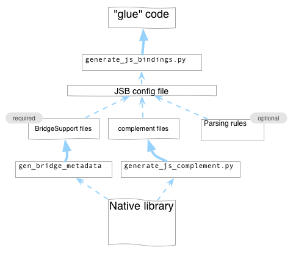

# Javascript Bindings for C and Objective-C

version 0.1

## What's this ?
JavaScript Bindings for C / Objective-C (JSB) is the "glue" code (or wrapper code) that sits between native code (C or Objective-C) and JavaScript (JS) code.
JSB allows calling native code from JS and vice-versa.

The JS code is interpreted by [SpiderMonkey](https://developer.mozilla.org/en-US/docs/SpiderMonkey), Mozilla's JS virtual machine (VM).
It uses the latest stable version of SpiderMonkey (as of this writing it is v14.0.1). The JS VM is extended by JSB to support custom types, custom structures and Objective-C objects.

JSB has a flexible set of rules that could be used to select the classes, methods, functions and structs to parse or ignore; which methods are callbacks; renaming rules, among some of its features. And to ease the creation of these rules, it supports regular expressions.

JSB could be used in complex libraries like [cocos2d](http://www.cocos2d-iphone.org) or [Chipmunk Physics](http://www.chipmunk-physics.net), without modifying the a single line of their code.

## How does it work ?

JSB comes with a python script called `generate_js_bindings.py` that generates the glue code. It needs a configuration file that contains the parsing rules and the [BridgeSupport](http://developer.apple.com/library/mac/#documentation/Darwin/Reference/ManPages/man5/BridgeSupport.5.html) files.

BridgeSupport files are generated by a script called [`gen_bridge_metada`](http://developer.apple.com/library/mac/#documentation/Darwin/Reference/ManPages/man1/gen_bridge_metadata.1.html#//apple_ref/doc/man/1/gen_bridge_metadata) that is part of OS X, and generates xml files with information like class names, method names, arguments, return values, internals of the structs, constants, etc. 

`gen_bridge_metada`, internally, uses [`clang`](http://clang.llvm.org/) to parse the native code. The output is very reliable, but unfortunately, it is not complete: class hierarchy, protocols and properties data is missing. That's why JSB comes with another python script, called `generate_js_complement.py`, that generates the missing information.

Once we have the configuration file setup, we can run the `generate_js_bindings.py` script to generate the glue code.

To summarize, the structure of a JSB configuration file is:

- Parsing rules (optional): renaming rules, classes to ignore/parse, etc...
- BridgeSupport files (required): Class, methods, functions, structs information
- Complement files (required for Objective-C projects): Hierarchy, protocol and properties information

## Internals of the JS bindings ("glue" code)

The JS bindings code allows to call JS code from native and vice-versa. It fowards native callbacks to JS. It supports "subclassing" native objects in JS. Let's see them in detail.

### Calling native functions from JS

The following code will call the the native C function `ccpAdd()`:

	var p1 = cc.p(0,0);
	var p2 = cc.p(1,1);
	var ret = cc.pAdd(p1, p2);  // cc.pAdd is a "wrapped" function, and it will call the cocos2d ccpAdd() C function

Let's take a look at the declaration of `ccpAdd`:

	CGPoint ccpAdd(const CGPoint v1, const CGPoint v2);

So when `cc.pAdd` is executed, it will call the "glue" function code `JSB_ccpAdd`. And `JSB_ccpAdd` is responsible of doing:

- converting the arguments from JS to native
- calling the native `ccpAdd()` function
- converting the return value from native to JS
- and should fail if there are errors converting either the arguments or the return value.

### Calling native instance or class methods from JS

It is also possible to call instace or class methods from JS. The internal logic is similar to calling native functions. Let's have look:

	// Creates a sprite and sets its position to 200,200
	var sprite = cc.Sprite.create('grossini.png');
	sprite.setPosition( cc.p(200,200) );

`cc.Sprite.create()` will create a native instance of `CCSprite`. The "glue" function responsible for that is `JSB_CCSprite_spriteWithFile_rect__static`. It will associate the JS object with the recently created native instance.
`cc.setPosition()` will call `JSB_CCNode_setPosition_`. And the first thin

### Classes

JSB also works with Objective-C objects. Example:

	var sprite = cc.Sprite.create("grossini.png"); // Creates a native cocos2d CCSprite (a native object);
	sprite.setPosition( cc.p(10,10) );  // sends the message "setPosition" to the newly created instance

### Arguments

JSB converts any Javascript arguments into valid native objects. In this case, the "sprite" argument is converted from a Javascript object into a CCSprite object.

	var scene = cc.Scene.create();  // creates a cocos2d CCScene object.
	scene.addChild( sprite );   // sends the "addChild" message to the scene.

### Messages

JSB can also merge multiple messages into one. Objective-C doesn't support optional arguments, but Javascript does. So it is possible to merge multiple messages into one. Example:

	-(void) addChild:(CCNode*)node;
	-(void) addChild:(CCNode*)node z:(NSInteger)z;
	-(void) addChild:(CCNode*)node z:(NSInteger)z tag:(NSInteger)tag;

can be merged into just one Javascript call. Example:

	scene.addChild( sprite );        // calls  addChild:
	scene.addChild( sprite, 10);     // calls  addChild:z:
	scene.addChild( sprite, 10, -1); // calls  addChild:z:tag: 

## Generating the bindigns

    $ cd cocos2d-iphone/externals/jsbindings/src/auto
    $ ../../generate_js_bindings.py -c ../../configs/cocos2d/cocos2d_jsb.ini 
    $ ../../generate_js_bindings.py -c ../../configs/chipmunk/chipmunk_jsb.ini 
    $ ../../generate_js_bindings.py -c ../../configs/CocosBuilderReader/CocosBuilderReader_jsb.ini 
    $ ../../generate_js_bindings.py -c ../../configs/CocosDenshion/CocosDenshion_jsb.ini 

