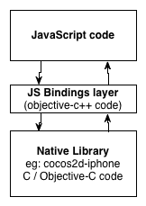

# Javascript Bindings for C and Objective-C

version 0.1

## What's this ?
JavaScript Bindings for C / Objective-C (JSB) is the "glue" code (or wrapper code) that sits between native code (C or Objective-C) and JavaScript (JS) code.
JSB allows calling native code from JS and vice-versa.

The JS code is interpreted by [SpiderMonkey](https://developer.mozilla.org/en-US/docs/SpiderMonkey), Mozilla's JS virtual machine (VM).
It uses the latest stable version of SpiderMonkey (as of this writing it is v14.0.1). The JS VM is extended to support custom types, custom structures and Objective-C objects.

JSB has a flexible set of rules that could be used to select the classes, methods, functions and structs to parse or ignore; which methods are callbacks; renaming rules, among some of its features. And to ease the creation of these rules, it supports regular expressions.

JSB could be used in complex libraries like [cocos2d](http://www.cocos2d-iphone.org) or [Chipmunk Physics](http://www.chipmunk-physics.net), without modifying the a single line of their code.

## How does it work ?

JSB comes with a python script called `generate_js_bindings.py` that generates the glue code. It needs a configuration file that contains the parsing rules and the [BridgeSupport](http://developer.apple.com/library/mac/#documentation/Darwin/Reference/ManPages/man5/BridgeSupport.5.html) files.

BridgeSupport files are generated by a script called [`gen_bridge_metada`](http://developer.apple.com/library/mac/#documentation/Darwin/Reference/ManPages/man1/gen_bridge_metadata.1.html#//apple_ref/doc/man/1/gen_bridge_metadata) that is part of OS X, and generates and xml files with Class information like method names, types used for the arguments, return values, etc. `gen_bridge_metada`, internally, uses clang.

## How to update the current bindings

    $ cd cocos2d-iphone/externals/jsbindings/src/auto
    $ ../../generate_js_bindings.py -c ../../configs/cocos2d/cocos2d_jsb.ini 
    $ ../../generate_js_bindings.py -c ../../configs/chipmunk/chipmunk_jsb.ini 
    $ ../../generate_js_bindings.py -c ../../configs/CocosBuilderReader/CocosBuilderReader_jsb.ini 
    $ ../../generate_js_bindings.py -c ../../configs/CocosDenshion/CocosDenshion_jsb.ini 

## Understanding the bindings

The Javascript Bidnings (JSB) generates the code needed to execute "native code" from Javascript. And by "native code" it could be any Objective-C (or C) library.

### Functions

As an example, the following code will execute 10 times the the native function "ccpAdd()":

	var p = cc.p(0,0);
	var q = cc.p(1,1);
	for( var i=0; i < 10; i++)
		p = cc.pAdd(p, q);   // cc.pAdd is a "wrapped" function, and it will call the cocos2d cc.pAdd() function

JSB will convert the Javascript object "p" into a valid CGPoint struct.

### Classes

JSB also works with Objective-C objects. Example:

	var sprite = cc.Sprite.create("grossini.png"); // Creates a native cocos2d CCSprite (a native object);
	sprite.setPosition( cc.p(10,10) );  // sends the message "setPosition" to the newly created instance

### Arguments

JSB converts any Javascript arguments into valid native objects. In this case, the "sprite" argument is converted from a Javascript object into a CCSprite object.

	var scene = cc.Scene.create();  // creates a cocos2d CCScene object.
	scene.addChild( sprite );   // sends the "addChild" message to the scene.

### Messages

JSB can also merge multiple messages into one. Objective-C doesn't support optional arguments, but Javascript does. So it is possible to merge multiple messages into one. Example:

	-(void) addChild:(CCNode*)node;
	-(void) addChild:(CCNode*)node z:(NSInteger)z;
	-(void) addChild:(CCNode*)node z:(NSInteger)z tag:(NSInteger)tag;

can be merged into just one Javascript call. Example:

	scene.addChild( sprite );        // calls  addChild:
	scene.addChild( sprite, 10);     // calls  addChild:z:
	scene.addChild( sprite, 10, -1); // calls  addChild:z:tag: 

